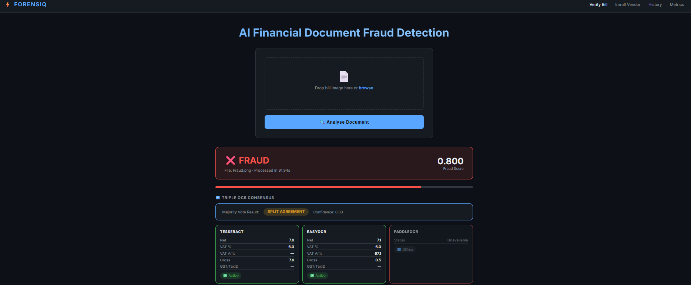

# 🔍 FORENSIQ
### Multimodal Financial Document Forgery Detection

*A 4-stream AI pipeline for real-time fraud detection on financial bills & invoices*

---

## Overview

**FORENSIQ** is an end-to-end multimodal fraud detection system that authenticates financial documents (GST bills, invoices, receipts) using a 4-stream processing pipeline. It combines deep learning visual forensics, triple-engine OCR consensus, arithmetic semantic validation, and a vendor context registry to detect tampering, forgery, and document anomalies — delivered through a real-time web dashboard.

---

## System Architecture

*4-layer pipeline: Input → Multi-Stream Core → Semantic & Contextual Validation → Adaptive Fusion Output*

---

## Key Features

| Feature | Description |
|---|---|
| **Visual Forensics** | ELA analysis, noise variance, JPEG ghost detection, copy-paste SIFT, CNN inference, edge consistency |
| **Triple OCR Consensus** | Tesseract + EasyOCR + PaddleOCR with majority-voting for robust text extraction |
| **Arithmetic Semantic Gate** | Hard rule: verifies `Net + VAT = Gross Total` — forced fraud flag on mismatch |
| **Vendor Registry** | SQLite-backed enrollment of known vendors with GST numbers, amount ranges & bill formats |
| **Adaptive Fusion** | Quality-aware weighted fusion producing a continuous `fraud_score` from 0.0 – 1.0 |
| **Audit Dashboard** | Full history with verdicts, scores, processing times, and trend charts |
| **XAI Heatmaps** | ELA heatmap overlays showing *where* on the document tampering was detected |

---

## UI Screenshots

### Bill Verification

### Audit History Dashboard

### Vendor Enrollment

### Metrics & Evaluation

---

## Tech Stack

**Backend:** Python 3.8+, Flask, TensorFlow/Keras, OpenCV, Pillow, NumPy, scikit-learn, SQLite

**OCR Engines:** Tesseract · EasyOCR · PaddleOCR

**Frontend:** HTML5, CSS3, JavaScript, Jinja2, Chart.js

---

## Verdict Logic

The final `fraud_score` (0.0 → 1.0) is thresholded as:

| Score Range | Verdict |
|---|---|
| `< 0.45` | ✅ **GENUINE** |
| `0.45 – 0.60` | ⚠️ **SUSPICIOUS** |
| `> 0.60` | ❌ **FRAUD** |

---

## License & Rights

> **© 2025 Chanchala Sai Gowtham. All Rights Reserved.**
>
> **Accepted for publication — IEEE ICDCA 2026.**
>
> This repository is shared for **viewing and reference purposes only**. Reproducing, copying, distributing, or building upon this work — including the codebase, methodology, trained models, or any associated materials — without explicit written permission from the author constitutes a violation of intellectual property rights and IEEE publication ethics.

---

## Contact

| Platform | Link |
|---|---|
| 💼 **LinkedIn** | [Chanchala Sai Gowtham](https://www.linkedin.com/in/chanchala-sai-gowtham-a06314322/) |
| 📧 **Email** | [saigowtham712@gmail.com](mailto:saigowtham712@gmail.com) |

---

  FORENSIQ · Accepted — IEEE ICDCA 2026 · © 2025 Chanchala Sai Gowtham

